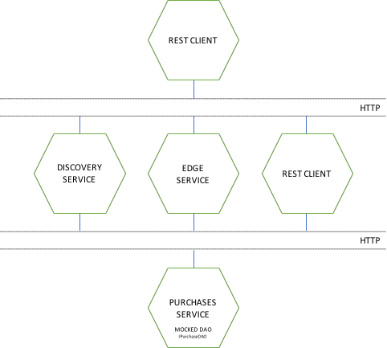

# Webstore Applications with spring cloud
## Sample Implementation

The purpose of this repository is to demonstrate a possible resolution for the following exercise:
Develop an API for other backend services to fetch and store product purchases. For now, the API only
needs to serve operations through a HTTP server that connects to a database that provides the company’s
purchases.
Another team will develop the database implementation only after your team creates the service.
You will implement the class that serves the requests and the method signatures for the database DAO,
which the other team will respect. Following is the schema for the data objects:

Purchase(id:Long, productType:String, expires:DateTime, purchaseDetails:Details)
Details(id:Long, description:String, quantity:Integer, value:Double)

The first operation retrieves purchase details related to valid company purchases.
1. it fetches a collection of all existing purchases from the database;
2. aggregates the results that are valid for the current time;
3. subsequently calls the database with a collection of the aggregated purchase ids;
4. the database yields all queried purchase details;
5. it then transforms the data into a textual data format and returns to the calling entity.

The second operation is responsible for storing - or handling updates - on the product purchases.

The database implementation is being developed by another team which stated that the expected SLA will be around 2 seconds.

The service should expose metrics to be collected by external services. Be free to expose all the metrics you think that has value to the server.

Expose relevant operations in the context of a microservice.
Take into account that this microservice should be able to scale.

## Application modules and organization
The application is composed be the fallowing modules:

1. discovery-service for locating services for the purpose of load balancing and failover of middle-tier servers
2. edge-service for providing dynamic routing, monitoring, resiliency
3. purchase-service for managing purchases (main scope for the exercise)
4. hystrix-dashboard for to monitor purchase-service Hystrix metrics in real time

## Used technologies and frameworks
The application uses the following set of light-weight technologies and frameworks:

1. Spring Boot for Bootstrapping and Boilerplates
2. Spring MVC for REST Services
4. Spring Cloud Netflix (Eureka, Hystrix, Zuul)
3. Spring aop with JamonPerformanceMonitorInterceptor to capturing performance metrics of the API
5. Spring REST Docs
6. Mockito for mocking and testing
7. Apidocs for generating more readable api documentation
8. Docker for deploy

## Prerequisites
Before running the above application, you'll need to install the following on your machine:

1. Maven 3.0.3 or later
2. docker and docker-compose

## Run
Once you have the above software installed, you can run the application using one of the fallowing methods:

**Using docker and run this command by the following order**

1. Go to the root directory of the application and type: `mvn clean install`
1. docker-compose up

**Step by step application start**

1. Start the `discovery-service` project.
You can start it by navigating to its subdirectory and type: `mvn spring-boot:run`
2. Start the `purchase-service` project.
You can start it by navigating to its subdirectory and type: `mvn spring-boot:run`
3. Start the `edge-service` project.
You can start it by navigating to its subdirectory and type: `mvn spring:boot:run`
4. Start the `hystrix-dashboard` project.
You can start it by navigating to its subdirectory and type: `mvn spring:boot:run`

## Interaction
You can interact with the api using a http rest client.
All the documentation is in the fallowing urls:

**In github pages:**
[https://pmribeiro.github.io/store-product-purchases/](https://pmribeiro.github.io/store-product-purchases/)

**or after you start the application:**
[http://localhost:8080/purchase-service/apidocs/index.html](http://localhost:8080/purchase-service/apidocs/index.html)

To check system usage metrics you can access hystrix dashboard using this urls:

**running with docker:**
[http://localhost:7979/hystrix/monitor?stream=http%3A%2F%2Fedge-service%3A8080%2Fpurchase-service%2Fhystrix.stream&delay=1&title=purchase-service](http://localhost:7979/hystrix/monitor?stream=http%3A%2F%2Fedge-service%3A8080%2Fpurchase-service%2Fhystrix.stream&delay=1&title=purchase-service)

**running with step by step application start:**
[http://localhost:7979/hystrix/monitor?stream=http%3A%2F%2Flocalhost%3A8080%2Fpurchase-service%2Fhystrix.stream&delay=1&title=purchase-service](http://localhost:7979/hystrix/monitor?stream=http%3A%2F%2Flocalhost%3A8080%2Fpurchase-service%2Fhystrix.stream&delay=1&title=purchase-service)

## Notes and important considerations
If the team responsible for implement the DAO must respect interface defined in
pt.pmribeiro.webstore.dao.IPurchaseDAO file in the purchase-service project.

The DAO part of the purchase-service is a in memory mock and because of this fact the application at this stage can't
be test for scalability. To test scalability we can consider that the DAO part is a external API and implement declarative
REST client load balancing using Ribbon or make a mock implementation using a real database using spring data.

## TODO
- IPurchaseDAO: change methods signature to return Future to monitor the quality of service with timeout. SLA <= 2s
- DTO's: use spring validators annotation
- PurchaseService: needs more info to decide to use parallelStream or stream -> for now consider its a big stream

## Next steps to consider
Adapt the application to use the fallowing patterns:

1. Domain Driven Design
2. Command Query Responsibility Segregation
3. Event Sourcing

Using the following technology and frameworks:

1. Apache Kafka or rabbitmq for Messaging (most probably kafka because of the speed and storage capabilities)
2. Couchbase for persistence
4. Spring Cloud Stream for event-driven microservices framework
3. Spring Cloud Data Flow for orchestration of microservice based data pipelines
4. Spring Cloud Config for centralized external configuration management

With this second approach will allow:

1. the application to be more scalable in terms of querying and writings because they will be different micro services.
2. to recreate scenarios for debugging and auditing
3. more flexibility to incorporate new functionalities
